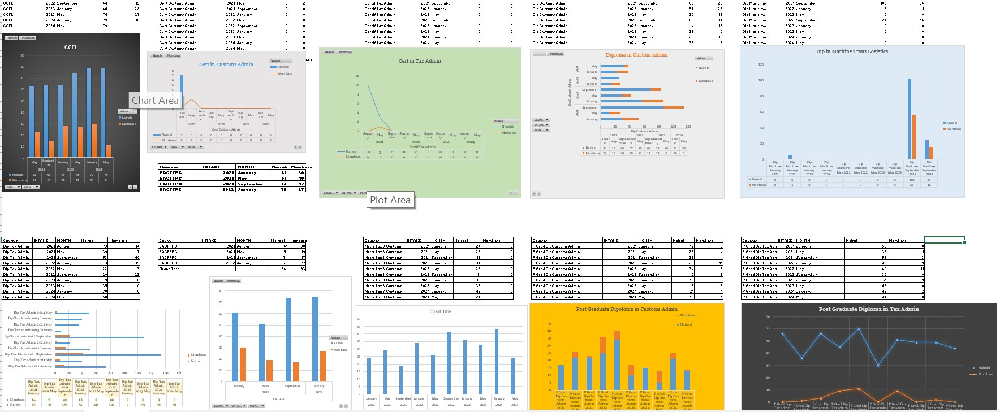

## Introduction

**This project ains to show case skills in data analysis using excel tools and function.
The dataset contains the backlog data fro the year 2021 to year 2024 for short courses in each intake.

_**Disclaimer_**: _**The data set does not reflect on any institution or company but rather a dummy for exhibition purposes._**

##Data Exploration and Transformation.
--
The process involved:
1. Data cleaning by removing duplicates and unnecessary details from the data.
2. Data indexing to ensure all details needed are updated. This was done using various lookup functions and formulars.
3. Strucrure the data in a format that is analysable by sorting, filtering and scaling the data.
4. Applying pivot table functions to read summaries of the data for easy analysis.

   
## Data Analysis
The aim of the analysis was to access and answer the following questions:
1. The perfomance of the courses in terms of numbers of intakes in each campus.
2. The favourable campus for each course.
3. The favorable intakes for each course.
4. Which course need to be scrapped off the training schedule.

