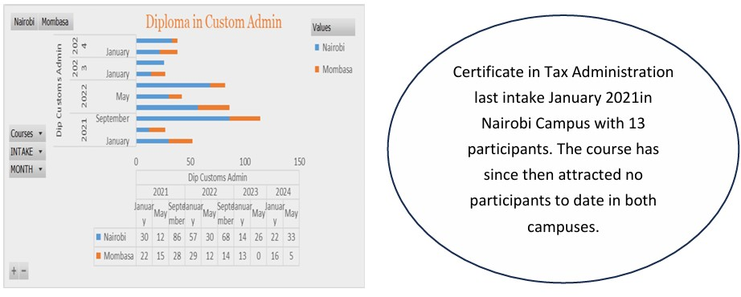
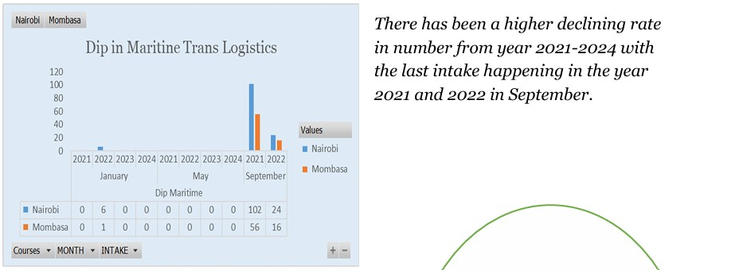
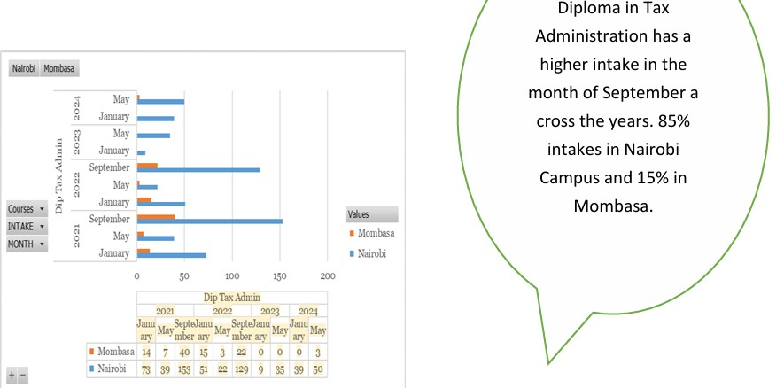
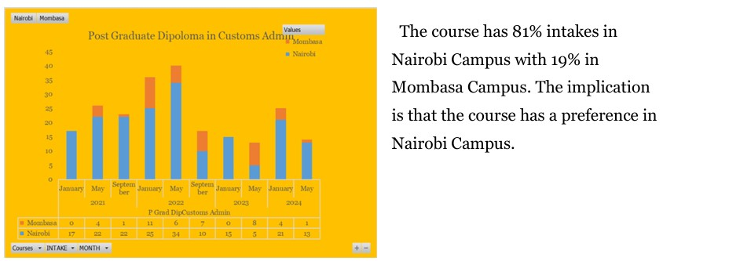
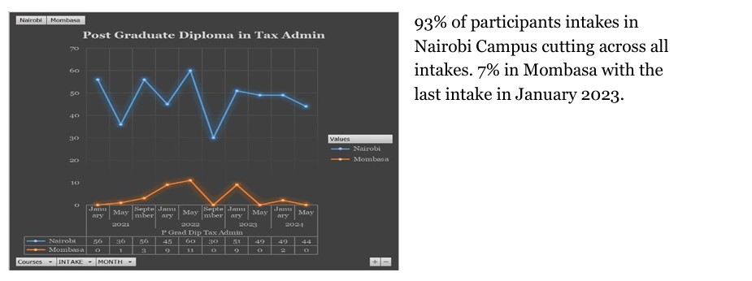
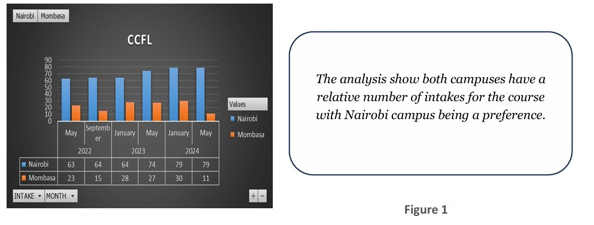
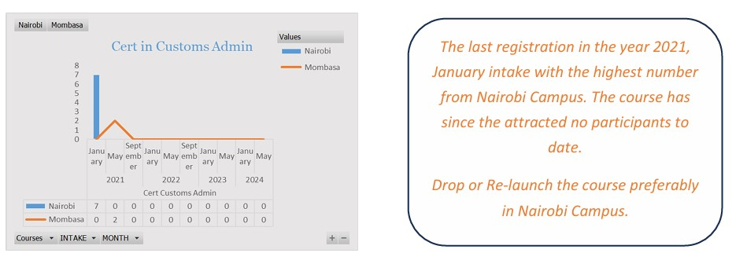
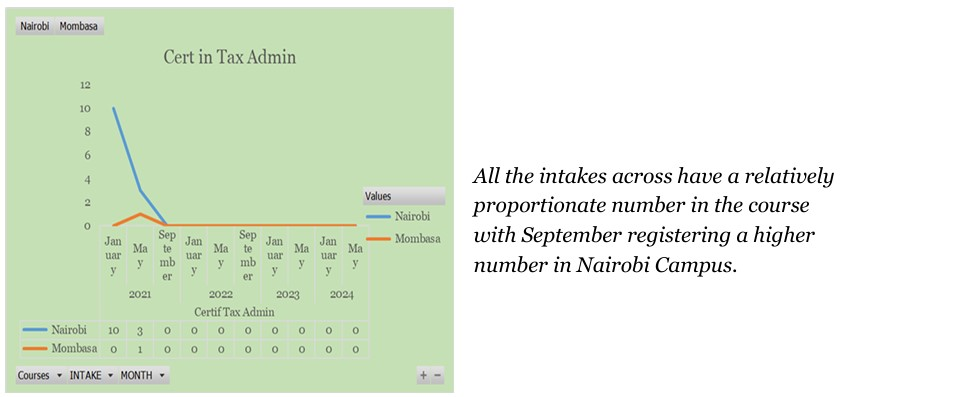

## Introduction

**This project ains to show case skills in data analysis using excel tools and function.
The dataset contains the backlog data fro the year 2021 to year 2024 for short courses in each intake.

_**Disclaimer_**: _**The data set does not reflect on any institution or company but rather a dummy for exhibition purposes._**

##Data Exploration and Transformation.
--
The process involved:
1. Data cleaning by removing duplicates and unnecessary details from the data.
2. Data indexing to ensure all details needed are updated. This was done using various lookup functions and formulars.
3. Strucrure the data in a format that is analysable by sorting, filtering and scaling the data.
4. Applying pivot table functions to read summaries of the data for easy analysis.

   
## Data Analysis
The aim of the analysis was to access and answer the following questions:
1. The perfomance of the courses in terms of numbers of intakes in each campus.
2. The favourable campus for each course.
3. The favorable intakes for each course.
4. Which course need to be scrapped off the training schedule.

## Findings & Analysis and Conclusion.
--
The following analysis findings were captured from the analysis and recorded for descisions and strategy purposes.
|-----------|-----------|-----------|
||

,,
,,

The project aim is to deliver actionable insights by management from a complex dataset.
The report aughts to give reliable source of evidence during the stakeholders seminars.

## How to use
1. **Clone the Repository**: Clone this project repository from GitHub.

2. **Set Up the Database**: Run the script provided in the 'REGISTERED STUDENTS DATA' file to create and populate the database.

3. **Run the Queries**: Use the various skills and  queries  to perform your analyis.

4. **Explore and Modify**: Feel free to modify the queries to explore different aspects of the dataset or answer additional business questions.

## Author- AnalystNgunjiri

This project is part of my portfolio, where i showcase the skills essenstial as a data analysts. If you gave any questions, feedback, or would like to collaborate, feel free to get in touch!

## Stay Updated and Join the Community

-**LinkedIn**: [Conect with my profile on the linkedIn page](https://www.linkedin.com/in/isaac-ngunjiri-35429026a)

-**PowerBI Profile**: [Interact with my reporting profile here](https://app.powerbi.com/groups/me/reports/0c5c1ec0-8774-45fc-b5d6-dd3de0ffa709/ReportSection?experience=power-bi)

-**Email**: [Reach of via my official mail](ngunjiriisaac6@gmail.com)

Thank you for your support, and I look forward to reconneccting with you.

